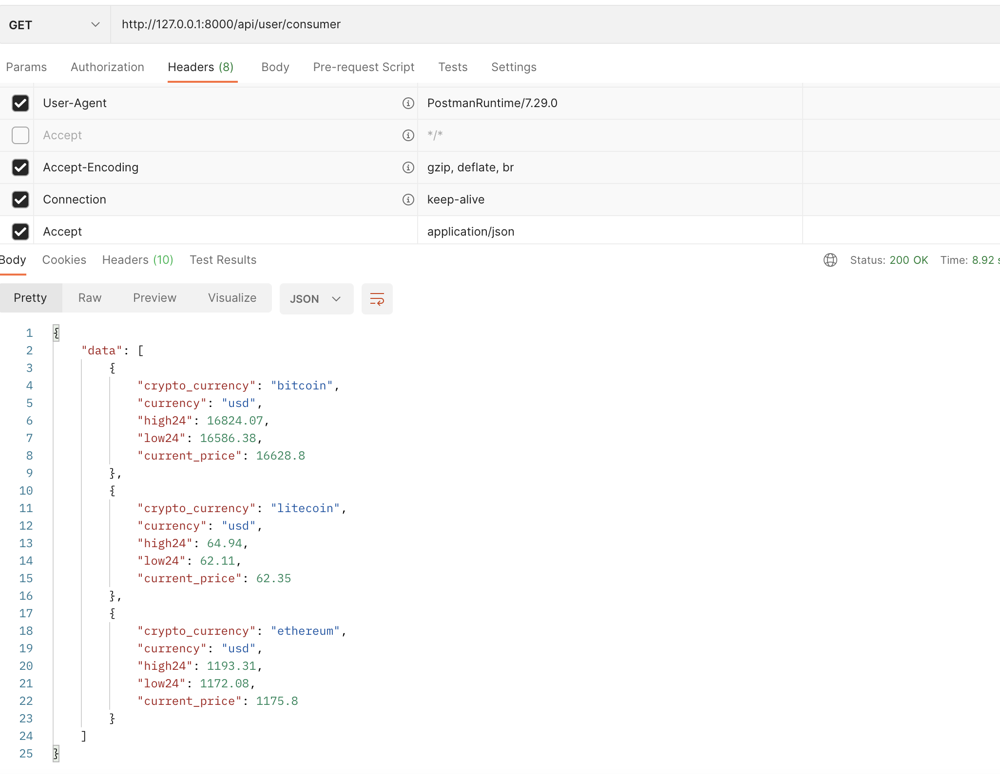

# Crypto Provider Integration

## Table of Content
* [Overview](#overview)
* [Demo](#demo)
* [Technical Aspect](#technical-aspect)
* [Tests Include](#tests-include)
* [Installation](#installation)

## Overview

Create a small API which consolidates some key data from a third party. 
The API must connect to the third party API “CoinGecko”, the documentation for which can be found here: 

https://www.coingecko.com/en/api/documentation.

The CoinGecko url is as follows:

https://api.coingecko.com/api/v3/

## Demo

### Note:
For demo purpose, high24, low24 and current price are integrated from coingecko api
- coins/markets
- simple/price

## Technical Aspect

### System Design

1. A new service provider with crypto config is registered to bind the provider interface with implementation
2. CryptoServiceInterface is used to define getPriceByCoin & getCoinsMarkets as common functions to fit all crypto providers
3. CoinGeckoService.getPriceByCoin implements CryptoServiceInterface with its own CoinPriceRequest & CoinPriceResponse which adapt AbstractCoinPriceRequest & CryptoCoinPriceResponse
4. CoinGeckoService.getCoinsMarkets implements CryptoServiceInterface with its own CoinsMarketsRequest & CoinMarketResponse which adapt AbstractCoinsMarketsRequest & CryptoCoinMarketResponse
5. The UserConsumerService uses CryptoServiceInterface to wrap the data and returns

#### Adding a new third-party provider:
1. Register a provider in CryptoServiceProvider
2. Update config in config/crypto.php
3. Create a "NewService" implements CryptoServiceInterface
4. Create request and response to adapt CoinPriceRequest, CoinsMarketsRequest, CoinPriceResponse and CoinMarketResponse
5. Update .env CRYPTO_PROVIDER to the new provider

#### Optimizations
1. If we want to mix different crypto provider with different apis, we can split CryptoServiceInterface into smaller interface
2. If we need more data from crypto provider, we can update CoinPriceResponse and CoinMarketResponse to load more as required
3. If some third-party crypto provider has a different payload, we can define its own requests which adapt AbstractCoinPriceRequest and AbstractCoinsMarketsRequest
4. If a third-party api is down, right now it returns 500 with and error message defined in Exception/Handler.php, and we can create different Exception json if necessary

### Data Flow

1. Api payload received
2. UserConsumerRequest validates payload
3. UserConsumerService is called with crypto service provider config
4. CoinGeckoService is called in this case to load data from third-party api
5. UserConsumerService returns UserConsumerResource containing all required data
  

### Technical Skills covers

- laravel framework 9
- form request validation
- service provider
- design patterns
- unit tests with mocking

## Tests Include

### Note
- UserConsumerControllerTest & CoinGeckoServiceTest tests integrate with CoinGecko which will send a real request to this api
- UserConsumerServiceTest mocks the CoinGecko api calls

## Installation

1. start api `` php artisan serve ``
2. run unit tests `` php artisan test ``
